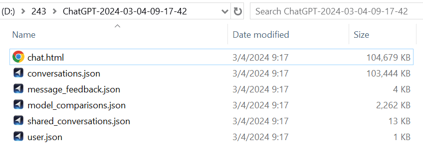

# The System Prompts from my ChatGPT Export

According to https://twitter.com/TheXeophon/status/1764318807009415500, "If you export your chat history from ChatGPT, you get the system prompt(s) for free, no jailbreaking or similar needed"

The [model_comparisons.json](./assets/model_comparisons.json) file contains the system prompts of my GPTs, such as PerfectGPT, Profile Pixie, Pix Muse, [Pixel Muse](https://github.com/BlueBirdBack/100-Days-of-GPTs/blob/main/Day-26-Pixel-Muse.md), and ChatGPT.

The file named `model_comparisons.json` includes system prompts from my GPTs including PerfectGPT, [Global Rankings](https://github.com/BlueBirdBack/100-Days-of-GPTs/blob/main/Day-4-Global-Rankings.md), [Web Mirror](https://github.com/BlueBirdBack/100-Days-of-GPTs/blob/main/Day-34-Web-Mirror.md), [Profile Pixie](https://github.com/BlueBirdBack/100-Days-of-GPTs/blob/main/Day-8-Profile-Pixie.md), [Pix Muse](https://github.com/BlueBirdBack/100-Days-of-GPTs/blob/main/Day-13-Pix-Muse.md), and [Pixel Muse](https://github.com/BlueBirdBack/100-Days-of-GPTs/blob/main/Day-26-Pixel-Muse.md), [Abstract Muse](https://github.com/BlueBirdBack/100-Days-of-GPTs/blob/main/Day-39-Abstract-Muse.md), [Chinese Muse](https://github.com/BlueBirdBack/100-Days-of-GPTs/blob/main/Day-35-Chinese-Muse.md), along with DALL-E and ChatGPT. I haven't discovered third-party GPTs created by others.
